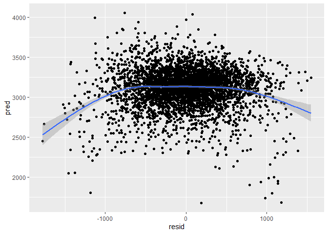
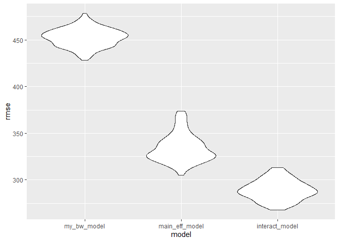
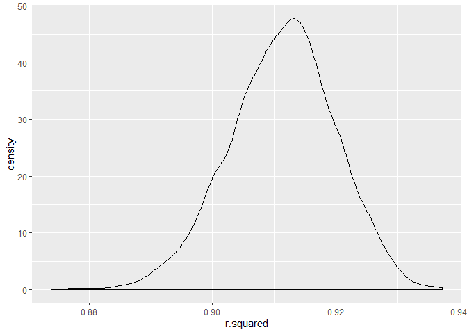
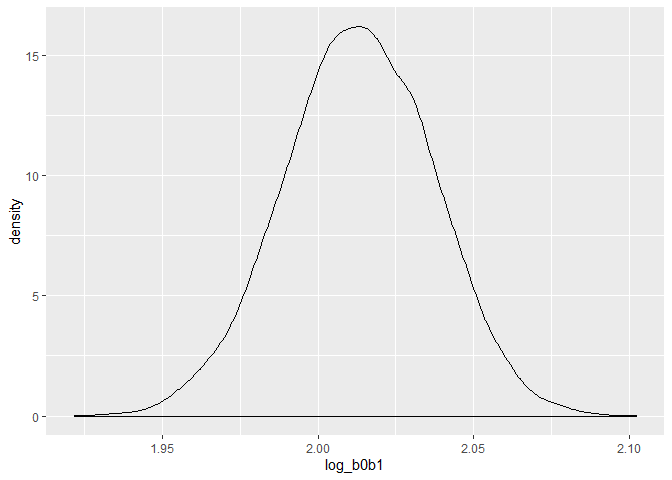

p8105\_hw6\_mrc2229
================
Matthew Curran
November 19, 2019

Problem 1
=========

Bring in and clean the birthweight data consisting of roughly 4000 children.
----------------------------------------------------------------------------

``` r
birthweight_data = read_csv ("./data/birthweight.csv") %>%
  janitor::clean_names() %>%
  rename(
    b_sex=babysex,
    b_headcirc=bhead,
    b_length=blength,
    b_bwt=bwt,
    m_wt_delivery=delwt, 
    fam_income_month=fincome, 
    f_race=frace,
    gest_age_wks=gaweeks, 
    m_age_menarche=menarche, 
    m_hgt=mheight,
    m_age_delivery=momage,
    m_race=mrace,
    births_prior=parity,
    prev_low_bwt=pnumlbw,
    prev_small_gest=pnumsga,
    m_prepreg_bmi=ppbmi,
    m_prepreg_wt=ppwt,
    ave_smoke=smoken,
    m_preg_wt_gain=wtgain
  ) %>%
  mutate(f_race=as.factor(f_race), m_race=as.factor(m_race), b_sex=as.factor(b_sex), malform=as.factor(malform)) 
```

    ## Parsed with column specification:
    ## cols(
    ##   .default = col_double()
    ## )

    ## See spec(...) for full column specifications.

-   Variables were renamed to be more descriptive and follow a more consistent structure.
-   Variables for race, sex, and presence of malformations that could affect weight were converted from numeric to factor variables.
-   There was no missing data to fill in or remove.
-   There are 4342 observations in the birthweight data set and 20 variables.

My Predictive Model
-------------------

-   I hypothesize that a mother’s weight gain during pregnancy (in pounds), gestational age (in weeks), and the mother's age during delivery are significant predictors for predicting a baby's birthweight.
-   Univariate anaylsis was run on all three of these predictors first to see their individual significance before adding them to a multivariable model, with a 5% level of significance. Only individually significant variables are added to the final model.

``` r
wt_gain_model = lm(b_bwt ~ m_preg_wt_gain, data = birthweight_data)
summary(wt_gain_model)
```

    ## 
    ## Call:
    ## lm(formula = b_bwt ~ m_preg_wt_gain, data = birthweight_data)
    ## 
    ## Residuals:
    ##      Min       1Q   Median       3Q      Max 
    ## -2421.89  -297.59    20.12   324.14  1619.69 
    ## 
    ## Coefficients:
    ##                 Estimate Std. Error t value Pr(>|t|)    
    ## (Intercept)    2858.9138    16.9621  168.55   <2e-16 ***
    ## m_preg_wt_gain   11.5703     0.6883   16.81   <2e-16 ***
    ## ---
    ## Signif. codes:  0 '***' 0.001 '**' 0.01 '*' 0.05 '.' 0.1 ' ' 1
    ## 
    ## Residual standard error: 496.3 on 4340 degrees of freedom
    ## Multiple R-squared:  0.06113,    Adjusted R-squared:  0.06092 
    ## F-statistic: 282.6 on 1 and 4340 DF,  p-value: < 2.2e-16

``` r
coef(wt_gain_model)
```

    ##    (Intercept) m_preg_wt_gain 
    ##     2858.91376       11.57031

-   With a p-value of &lt;2e-16, there is sufficient evidence to suggest mother’s weight gain during pregnancy is a significant predictor of a baby's birthweight.

``` r
gest_age_wks_model = lm(b_bwt ~ gest_age_wks, data = birthweight_data)
summary(gest_age_wks_model)
```

    ## 
    ## Call:
    ## lm(formula = b_bwt ~ gest_age_wks, data = birthweight_data)
    ## 
    ## Residuals:
    ##      Min       1Q   Median       3Q      Max 
    ## -1730.52  -292.85    -0.78   303.47  1591.36 
    ## 
    ## Coefficients:
    ##              Estimate Std. Error t value Pr(>|t|)    
    ## (Intercept)   476.003     88.809    5.36 8.76e-08 ***
    ## gest_age_wks   66.920      2.245   29.80  < 2e-16 ***
    ## ---
    ## Signif. codes:  0 '***' 0.001 '**' 0.01 '*' 0.05 '.' 0.1 ' ' 1
    ## 
    ## Residual standard error: 466.7 on 4340 degrees of freedom
    ## Multiple R-squared:  0.1699, Adjusted R-squared:  0.1697 
    ## F-statistic: 888.3 on 1 and 4340 DF,  p-value: < 2.2e-16

``` r
coef(gest_age_wks_model)
```

    ##  (Intercept) gest_age_wks 
    ##    476.00261     66.91991

-   With a p-value of &lt;2e-16, there is sufficient evidence to suggest gestational age is a significant predictor of a baby's birthweight.

``` r
m_age_delivery_model = lm(b_bwt ~ m_age_delivery, data = birthweight_data)
summary(m_age_delivery_model)
```

    ## 
    ## Call:
    ## lm(formula = b_bwt ~ m_age_delivery, data = birthweight_data)
    ## 
    ## Residuals:
    ##      Min       1Q   Median       3Q      Max 
    ## -2514.04  -291.97    20.03   332.03  1717.82 
    ## 
    ## Coefficients:
    ##                Estimate Std. Error t value Pr(>|t|)    
    ## (Intercept)    2750.407     41.047  67.007   <2e-16 ***
    ## m_age_delivery   17.932      1.986   9.028   <2e-16 ***
    ## ---
    ## Signif. codes:  0 '***' 0.001 '**' 0.01 '*' 0.05 '.' 0.1 ' ' 1
    ## 
    ## Residual standard error: 507.5 on 4340 degrees of freedom
    ## Multiple R-squared:  0.01843,    Adjusted R-squared:  0.01821 
    ## F-statistic: 81.51 on 1 and 4340 DF,  p-value: < 2.2e-16

``` r
coef(m_age_delivery_model)
```

    ##    (Intercept) m_age_delivery 
    ##     2750.40746       17.93159

-   With a p-value of &lt;2e-16, there is sufficient evidence to suggest mother’s age at delivery is a significant predictor of a baby's birthweight.

-   All of the proposed predictors were individually significant, so a multivariable linear model was made using all three.

``` r
my_bw_model = lm(b_bwt ~ m_preg_wt_gain + gest_age_wks + m_age_delivery, data = birthweight_data)
summary(my_bw_model)
```

    ## 
    ## Call:
    ## lm(formula = b_bwt ~ m_preg_wt_gain + gest_age_wks + m_age_delivery, 
    ##     data = birthweight_data)
    ## 
    ## Residuals:
    ##      Min       1Q   Median       3Q      Max 
    ## -1772.53  -289.29     6.08   294.96  1545.50 
    ## 
    ## Coefficients:
    ##                Estimate Std. Error t value Pr(>|t|)    
    ## (Intercept)    240.9880    90.2803   2.669  0.00763 ** 
    ## m_preg_wt_gain   9.4709     0.6392  14.817  < 2e-16 ***
    ## gest_age_wks    59.9882     2.2234  26.980  < 2e-16 ***
    ## m_age_delivery  14.7382     1.7958   8.207 2.96e-16 ***
    ## ---
    ## Signif. codes:  0 '***' 0.001 '**' 0.01 '*' 0.05 '.' 0.1 ' ' 1
    ## 
    ## Residual standard error: 453.2 on 4338 degrees of freedom
    ## Multiple R-squared:  0.2175, Adjusted R-squared:  0.2169 
    ## F-statistic: 401.9 on 3 and 4338 DF,  p-value: < 2.2e-16

``` r
coef(my_bw_model)
```

    ##    (Intercept) m_preg_wt_gain   gest_age_wks m_age_delivery 
    ##     240.987977       9.470899      59.988212      14.738213

-   The null hypothesis is that this model has no predictive value of a baby's birth weight. The alternative hypothesis is that this model has some predictive value of a baby's birth weight.
-   This multivariable model was found to have an F-statistic of 401.9 on 3 and 4338 Degrees of freedom with a p-value of &lt; 2.2e-16.
-   Based on this F-statistic and p-value, we reject the null hyphothesis and conclude that the mother’s weight gain during pregnancy (in pounds), gestational age (in weeks), and the mother's age during delivery are significant predictors of a baby's birthweight.
-   With an R-squared value of 0.2175, 21.75% of the variation in a baby's birthweight can be explained by this linear model, the rest remains unexplained.

Plot of model residuals against fitted values
---------------------------------------------

``` r
resid_fit_plot = birthweight_data %>% 
  add_predictions(my_bw_model) %>%
  add_residuals(my_bw_model) %>%
  ggplot(aes(x = resid, y = pred)) + geom_point() + 
  geom_smooth(aes(y = pred))

resid_fit_plot
```

    ## `geom_smooth()` using method = 'gam' and formula 'y ~ s(x, bs = "cs")'



-   The above plot shows my birthwieght predicting linear model's residuals against the fitted values from the model. A smooth predictive line was added to the model.

Comparing my model to two others
--------------------------------

-   The first model predicts baby birthweight via the direct effects of length at birth and gestational age as predictors.
-   The second model uses head circumference, length, sex, and all their interactions (including the three-way interaction) as the predictors.

``` r
main_eff_model = lm(b_bwt ~ b_length + gest_age_wks, data = birthweight_data)
interact_model = lm(b_bwt ~ b_length + b_sex + b_headcirc + b_length*b_sex + b_length*b_headcirc + b_sex*b_headcirc + b_length*b_sex*b_headcirc, data = birthweight_data)

summary(main_eff_model)
```

    ## 
    ## Call:
    ## lm(formula = b_bwt ~ b_length + gest_age_wks, data = birthweight_data)
    ## 
    ## Residuals:
    ##     Min      1Q  Median      3Q     Max 
    ## -1709.6  -215.4   -11.4   208.2  4188.8 
    ## 
    ## Coefficients:
    ##               Estimate Std. Error t value Pr(>|t|)    
    ## (Intercept)  -4347.667     97.958  -44.38   <2e-16 ***
    ## b_length       128.556      1.990   64.60   <2e-16 ***
    ## gest_age_wks    27.047      1.718   15.74   <2e-16 ***
    ## ---
    ## Signif. codes:  0 '***' 0.001 '**' 0.01 '*' 0.05 '.' 0.1 ' ' 1
    ## 
    ## Residual standard error: 333.2 on 4339 degrees of freedom
    ## Multiple R-squared:  0.5769, Adjusted R-squared:  0.5767 
    ## F-statistic:  2958 on 2 and 4339 DF,  p-value: < 2.2e-16

``` r
summary(interact_model)
```

    ## 
    ## Call:
    ## lm(formula = b_bwt ~ b_length + b_sex + b_headcirc + b_length * 
    ##     b_sex + b_length * b_headcirc + b_sex * b_headcirc + b_length * 
    ##     b_sex * b_headcirc, data = birthweight_data)
    ## 
    ## Residuals:
    ##      Min       1Q   Median       3Q      Max 
    ## -1132.99  -190.42   -10.33   178.63  2617.96 
    ## 
    ## Coefficients:
    ##                              Estimate Std. Error t value Pr(>|t|)    
    ## (Intercept)                -7176.8170  1264.8397  -5.674 1.49e-08 ***
    ## b_length                     102.1269    26.2118   3.896 9.92e-05 ***
    ## b_sex2                      6374.8684  1677.7669   3.800 0.000147 ***
    ## b_headcirc                   181.7956    38.0542   4.777 1.84e-06 ***
    ## b_length:b_sex2             -123.7729    35.1185  -3.524 0.000429 ***
    ## b_length:b_headcirc           -0.5536     0.7802  -0.710 0.478012    
    ## b_sex2:b_headcirc           -198.3932    51.0917  -3.883 0.000105 ***
    ## b_length:b_sex2:b_headcirc     3.8781     1.0566   3.670 0.000245 ***
    ## ---
    ## Signif. codes:  0 '***' 0.001 '**' 0.01 '*' 0.05 '.' 0.1 ' ' 1
    ## 
    ## Residual standard error: 287.7 on 4334 degrees of freedom
    ## Multiple R-squared:  0.6849, Adjusted R-squared:  0.6844 
    ## F-statistic:  1346 on 7 and 4334 DF,  p-value: < 2.2e-16

-   In terms of the cross-validated prediction error, the model with the lowest root mean squared errors (RMSEs) is suggested to work the best.
-   My original model has an RMSE of 452.997342
-   The model with the direct effects of length at birth and gestational age has an RMSE of 333.1022771
-   The final model with head circumference, length, sex, and all their interactions has an RMSE of 287.4692441
-   The RMSEs are suggestive that both of the comparison models work better than my proposed model, and that the model with head circumference, length, sex, and all their interactions is the best model of all three. However, to get a sense of model stability we really need to iterate this whole process.

``` r
bw_cv_df = 
  crossv_mc(birthweight_data, 100)

bw_cv_df = 
  bw_cv_df %>% 
  mutate(my_bw_model  = map(train, ~lm(b_bwt ~ m_preg_wt_gain + gest_age_wks + m_age_delivery, data = .x)),
         main_eff_model  = map(train, ~lm(b_bwt ~ b_length + gest_age_wks, data = .x)),
         interact_model  = map(train, ~lm(b_bwt ~ b_length + b_sex + b_headcirc + b_length*b_sex + b_length*b_headcirc + b_sex*b_headcirc + b_length*b_sex*b_headcirc, data = .x))) %>% 
  mutate(rmse_my_bw_model = map2_dbl(my_bw_model, test, ~rmse(model = .x, data = .y)),
         rmse_main_eff_model = map2_dbl(main_eff_model, test, ~rmse(model = .x, data = .y)),
         rmse_interact_model = map2_dbl(interact_model, test, ~rmse(model = .x, data = .y)))

bw_cv_df %>% 
  select(starts_with("rmse")) %>% 
pivot_longer(
    everything(),
    names_to = "model", 
    values_to = "rmse",
    names_prefix = "rmse_") %>% 
  mutate(model = fct_inorder(model)) %>% 
  ggplot(aes(x = model, y = rmse)) + geom_violin()
```



-   Now we get a sense of variance in prediction error and can compare prediction error distributions across method and come to the same conclusion as before; the model with head circumference, length, sex, and all their interactions is the best model of all three and has the most predictive accuracy.

Problem 2
=========

Load in Weather data and Bootstrap
----------------------------------

``` r
set.seed(1)

weather_df = 
  rnoaa::meteo_pull_monitors(
    c("USW00094728"),
    var = c("PRCP", "TMIN", "TMAX"), 
    date_min = "2017-01-01",
    date_max = "2017-12-31") %>%
  mutate(
    name = recode(id, USW00094728 = "CentralPark_NY"),
    tmin = tmin / 10,
    tmax = tmax / 10) %>%
  select(name, id, everything())%>% 
  bootstrap(n = 5000)
```

    ## Registered S3 method overwritten by 'crul':
    ##   method                 from
    ##   as.character.form_file httr

    ## Registered S3 method overwritten by 'hoardr':
    ##   method           from
    ##   print.cache_info httr

    ## file path:          C:\Users\Madeline\AppData\Local\rnoaa\rnoaa\Cache/ghcnd/USW00094728.dly

    ## file last updated:  2019-10-30 18:27:14

    ## file min/max dates: 1869-01-01 / 2019-10-31

Distribution of R-squared
-------------------------

``` r
r_strap=weather_df %>%
  mutate(models = map(strap, ~lm(tmax ~ tmin, data = .x) ),
         results = map(models, broom::glance)) %>% 
  select(-strap, -models) %>% 
  unnest() 
```

    ## Warning: `cols` is now required.
    ## Please use `cols = c(results)`

``` r
r_plot=r_strap%>%
  ggplot(aes(x = r.squared)) + geom_density()

r_plot
```



-   The distribution of r-squared estimates appears to be left-skewed, and most of the estimates appear to fall between 0.90 and 0.92, with some higher than 0.93 and some lower than 0.88. Overall, the estimated values of r-squared in this sample are high.

-   The 95% Confidence Interval of the r-squared estimates is (0.89, 0.93).

Distribution of log(β^0 ∗ β^1)
------------------------------

``` r
beta_strap=weather_df %>%
  mutate(
    models = map(strap, ~ lm(tmax ~ tmin, data = .x)),
    results = map(models, broom::tidy))%>% 
  select(-strap, -models) %>% 
  unnest() %>% 
  select(id = `.id`, term, estimate) %>% 
  spread(key = term, value = estimate) %>% 
  rename(beta0 = `(Intercept)`, beta1 = tmin) %>% 
  mutate(log_b0b1 = log(beta0 * beta1))
```

    ## Warning: `cols` is now required.
    ## Please use `cols = c(results)`

``` r
beta_plot=beta_strap %>%
  ggplot(aes(x = log_b0b1)) + geom_density()

beta_plot
```



-   The distribution of log(β^0 ∗ β^1) looks fairly symetric. Most of the estimates seem to fall between 1.97 and 2.03, with some estimates going above 2.10 on the higher end and near 1.93 on the lower end. It makes sense that the skewness went away due to the log transformation.

-   The 95% Confidence Interval of the log(β^0 ∗ β^1) estimates is (1.96, 2.06).
